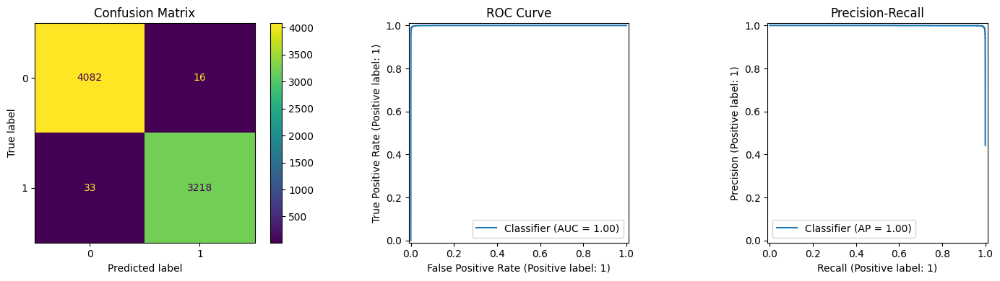
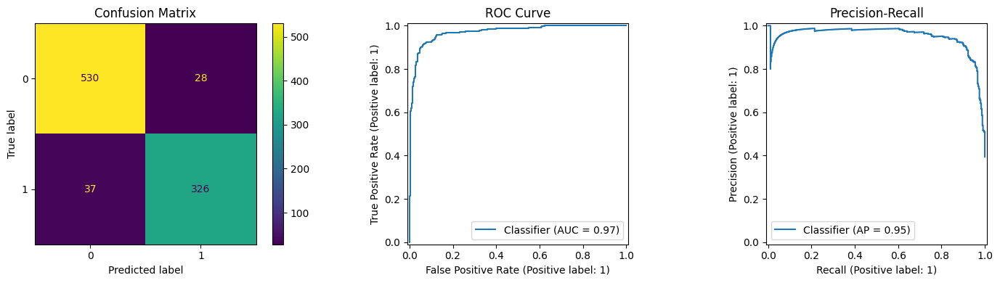
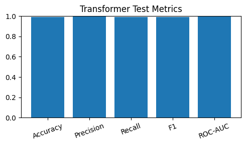
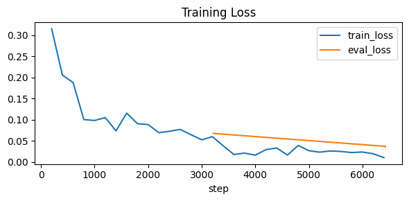
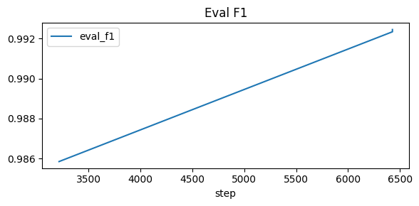
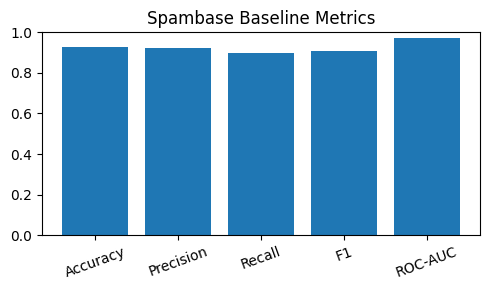
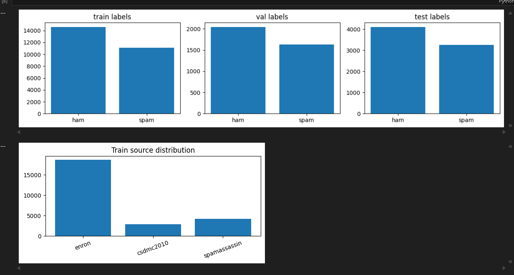

# SpamGuard - Notebook-First Transformer Email Spam Classifier

SpamGuard fine-tunes a Transformer encoder to label emails as **SPAM (1)** or **HAM (0)**. The project is intentionally notebook-driven: run one Jupyter notebook that covers environment checks, dataset ingestion, training, evaluation, and `.eml` inference.

---

## What It Does
- Loads and unifies multiple public email corpora, then deduplicates content.
- Fine-tunes a Hugging Face Transformer (default **XLM-RoBERTa**) with gradient checkpointing and Trainer API.
- Evaluates with accuracy / precision / recall / F1 (+ optional ROC-AUC, confusion matrix, ROC/PR plots).
- Parses raw `.eml` files (plain text + common HTML cases) and returns a spam probability + label.
- Provides a classical sanity-check baseline on the **Spambase** tabular dataset (logistic regression).
- Includes a **quick-dev** mode to cap rows per source for fast iteration.

---

## Repository Layout
- `SpamGuard_Transformer_Email_Spam_Classifier.ipynb` - end-to-end notebook (env checks -> data -> train -> eval -> inference).
- `test/` - sample `.eml` files in English/Hebrew for quick inference checks.
- `data/` - place downloaded corpora here (for example, `trec07p.tgz`). Not tracked by Git.
- `.hf_cache/` - local Hugging Face cache (kept ASCII-only to avoid Windows SentencePiece path issues).
- `globalSpm.model/` - default output directory for the trained model/tokenizer (created after training).

---

## Setup
Requirements: Python **3.10+**; GPU optional (the notebook auto-detects CUDA and can run on CPU).

1) Create a virtual environment (recommended):
   - Windows: `python -m venv .venv && .\\.venv\\Scripts\\activate`
   - macOS/Linux: `python -m venv .venv && source .venv/bin/activate`
2) Upgrade pip: `python -m pip install --upgrade pip`
3) Dependencies: the notebook can auto-install pinned versions (`CFG.INSTALL_DEPS=True`).  
   If you prefer preinstalling, use:
   ```bash
   pip install torch torchvision torchaudio --index-url https://download.pytorch.org/whl/cu121  # or remove --index-url for CPU-only
   pip install numpy scipy pandas scikit-learn pyarrow xxhash tokenizers safetensors sentencepiece tqdm \
               huggingface-hub datasets transformers accelerate fsspec packaging matplotlib
   ```

---

## Data Sources
Enabled by default (toggle in the `CFG` cell):
- **EnronSpam (HuggingFace `AlignmentResearch/EnronSpam`)** - pulled via `datasets`.
- **SpamAssassin public corpus** - downloaded from apache.org; parsed from raw `.tar.bz2`.
- **CSDMC2010** - pulled from a GitHub mirror (`ham.zip` / `spam.zip`).
- **TREC07p** - manual: download `trec07p.tgz` after accepting the terms at https://plg.uwaterloo.ca/~gvcormac/treccorpus07/ and place it at `data/trec07p.tgz`.

Controls:
- `MAX_PER_SOURCE` caps rows per corpus; `QUICK_DEV=True` switches to a smaller cap (`QUICK_DEV_MAX_PER_SOURCE`) and can skip sources via `QUICK_DEV_SKIP_SOURCES`.
- All text rows are deduplicated by SHA-256 hash before splitting.

---

## Running the Notebook
1) Open `SpamGuard_Transformer_Email_Spam_Classifier.ipynb`.
2) Run **Setup** to verify Python/venv and GPU detection.
3) Adjust **Config (`CFG`)** as needed:
   - `MODEL_NAME` (default `xlm-roberta-base`)
   - dataset toggles (`ENABLE_*`) and paths (`TREC07_TGZ_PATH`)
   - training params (`MAX_LEN`, `TRAIN_EPOCHS`, `TRAIN_BATCH`, `LR`, etc.)
   - `OUTPUT_DIR` for model artifacts
4) Run cells top -> bottom:
   - Dependency install/check
   - Dataset loading and dedup
   - Train/val/test split (stratified; TREC uses chronological split)
   - Tokenization, training (Hugging Face Trainer), evaluation + plots
   - Optional **Spambase** baseline (`RUN_SPAMBASE_BASELINE=True`)
   - Save model/tokenizer to `OUTPUT_DIR`

---

## Inference on `.eml`
- After training (or after loading a saved model via `load_model_if_needed` inside the notebook), run the **EML Parsing + Test** cell or call:
  ```python
  pred = predict_spam_from_eml("test/spam_en.eml")  # returns {"spam_probability": float, "prediction": "SPAM"|"HAM"}
  ```
- The parser strips common HTML, ignores attachments, and builds a text payload from headers plus body.
- Use the provided `test/` samples to sanity-check predictions; replace with your own `.eml` files as needed.

---

## Outputs
- Trained model and tokenizer saved to `globalSpm.model/` (or your custom `OUTPUT_DIR`).
- Printed metrics for validation/test; optional confusion matrix, ROC, and PR plots if `matplotlib` is available.
- Spambase baseline metrics and optional plots when enabled.

---

## Sample Results (notebook run R1)

<div align="center">
  
</div>

<div align="center">
  
</div>

<div align="center">
  
  
  
  
</div>

<div align="center">
  
</div>

---

## Limitations and Notes
- Email text can be noisy (signatures, quoted replies, HTML templates); performance may degrade without further cleaning.
- Dataset shift is real: spam content evolves. Re-train periodically for production-like use.
- Not production-hardened: no MTA hooks, sandboxing, or adversarial filtering are provided.
- Keep Hugging Face cache paths ASCII on Windows to avoid SentencePiece path issues (`HF_CACHE_DIR` is set to `./.hf_cache`).

---

## Data Policy
The repository does not redistribute raw corpora. You are responsible for:
- obtaining datasets under their respective licenses and terms
- handling privacy/PII appropriately
- complying with your institution or company policies

---

## License and Disclaimer
- Code is released under the MIT License (see `LICENSE`).
- Educational/research use only. Do not process real user mail without proper authorization and compliance review.
