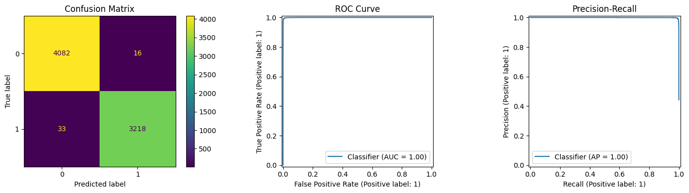
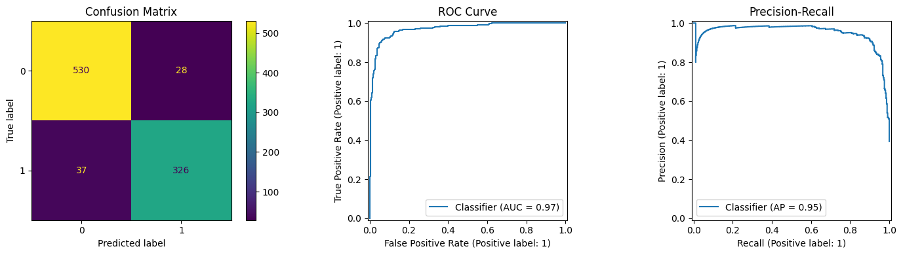
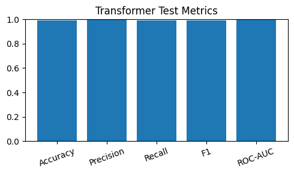
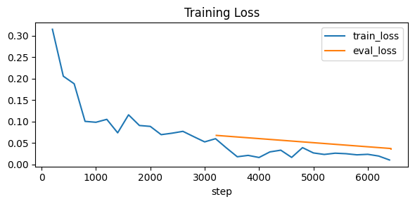
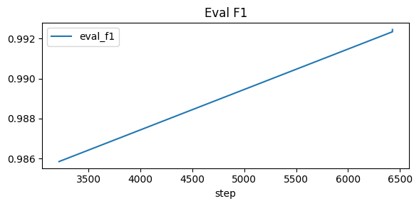
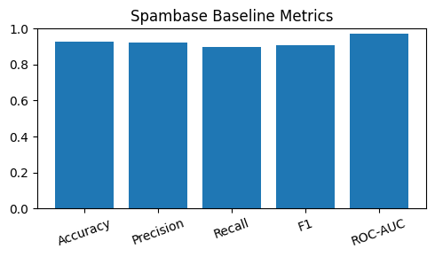
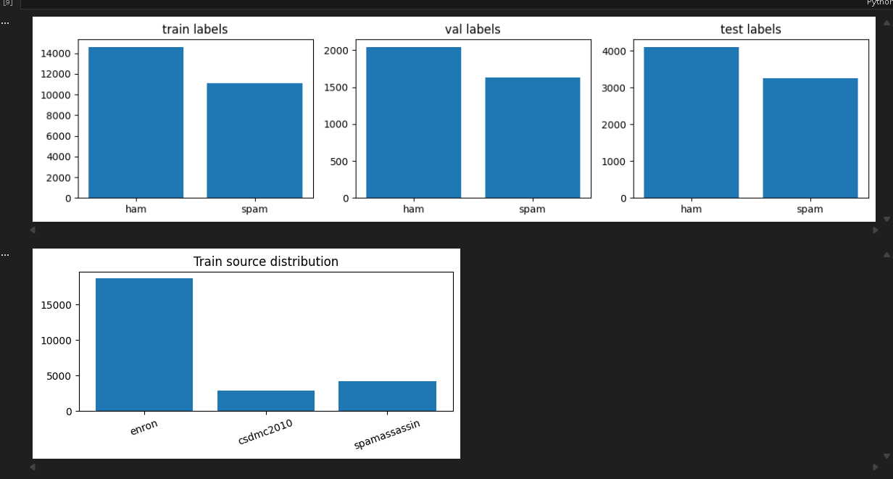

# SpamGuard - Notebook-First Transformer Email Spam Classifier

SpamGuard fine-tunes a Transformer encoder to label emails as **SPAM (1)** or **HAM (0)**. The project is intentionally notebook-driven: run one Jupyter notebook that covers environment checks, dataset ingestion, training, evaluation, and `.eml` inference.

---

## What It Does
- Loads and unifies multiple public email corpora, then deduplicates content.
- Fine-tunes a Hugging Face Transformer (default **XLM-RoBERTa**) with gradient checkpointing and Trainer API.
- Evaluates with accuracy / precision / recall / F1 (+ optional ROC-AUC, confusion matrix, ROC/PR plots).
- Parses raw `.eml` files (plain text + common HTML cases) and returns a spam probability + label.
- Adds a **Streamlit demo app** that can import Gmail messages, scan a local mailbox folder, and show results in a review-friendly UI.
- Provides a classical sanity-check baseline on the **Spambase** tabular dataset (logistic regression).
- Includes a **quick-dev** mode to cap rows per source for fast iteration.

---

## Repository Layout
- `SpamGuard_Transformer_Email_Spam_Classifier.ipynb` - end-to-end notebook (env checks -> data -> train -> eval -> inference).
- `spamguard_demo/` - reusable inference layer for local `.eml` files, Gmail OAuth import, and batch classification.
- `streamlit_app.py` - demo UI for Gmail OAuth connect/refresh/disconnect, preview, and classification results.
- `requirements-demo.txt` - additional dependency for the demo UI.
- `test/` - sample `.eml` files in English/Hebrew for quick inference checks.
- `test/mails/` - runtime-only local/Gmail mailbox folders used by the demo app.
- `test/result/` - runtime-only spam/ham outputs and `results.csv` manifest generated by the demo app.
- `data/` - place downloaded corpora here (for example, `trec07p.tgz`). Not tracked by Git.
- `.hf_cache/` - local Hugging Face cache (kept ASCII-only to avoid Windows SentencePiece path issues).
- `globalSpm.model/` - default output directory for the trained model/tokenizer (created after training).

---

## Setup
Requirements: Python **3.10+**; GPU optional (the notebook auto-detects CUDA and can run on CPU).

1) Create a virtual environment (recommended):
   - Windows: `python -m venv .venv && .\\.venv\\Scripts\\activate`
   - macOS/Linux: `python -m venv .venv && source .venv/bin/activate`
2) Upgrade pip: `python -m pip install --upgrade pip`
3) Dependencies: the notebook can auto-install pinned versions (`CFG.INSTALL_DEPS=True`).  
   If you prefer preinstalling, use:
   ```bash
   pip install torch torchvision torchaudio --index-url https://download.pytorch.org/whl/cu121  # or remove --index-url for CPU-only
   pip install numpy scipy pandas scikit-learn pyarrow xxhash tokenizers safetensors sentencepiece tqdm \
               huggingface-hub datasets transformers accelerate fsspec packaging matplotlib
   ```
4) Demo UI dependency:
   ```bash
   pip install -r requirements-demo.txt
   ```
   This installs `streamlit`, `google-api-python-client`, `google-auth-httplib2`, and `google-auth-oauthlib`.

---

## Data Sources
Enabled by default (toggle in the `CFG` cell):
- **EnronSpam (HuggingFace `AlignmentResearch/EnronSpam`)** - pulled via `datasets`.
- **SpamAssassin public corpus** - downloaded from apache.org; parsed from raw `.tar.bz2`.
- **CSDMC2010** - pulled from a GitHub mirror (`ham.zip` / `spam.zip`).
- **TREC07p** - manual: download `trec07p.tgz` after accepting the terms at https://plg.uwaterloo.ca/~gvcormac/treccorpus07/ and place it at `data/trec07p.tgz`.

Controls:
- `MAX_PER_SOURCE` caps rows per corpus; `QUICK_DEV=True` switches to a smaller cap (`QUICK_DEV_MAX_PER_SOURCE`) and can skip sources via `QUICK_DEV_SKIP_SOURCES`.
- All text rows are deduplicated by SHA-256 hash before splitting.

---

## Running the Notebook
1) Open `SpamGuard_Transformer_Email_Spam_Classifier.ipynb`.
2) Run **Setup** to verify Python/venv and GPU detection.
3) Adjust **Config (`CFG`)** as needed:
   - `MODEL_NAME` (default `xlm-roberta-base`)
   - dataset toggles (`ENABLE_*`) and paths (`TREC07_TGZ_PATH`)
   - training params (`MAX_LEN`, `TRAIN_EPOCHS`, `TRAIN_BATCH`, `LR`, etc.)
   - `OUTPUT_DIR` for model artifacts
4) Run cells top -> bottom:
   - Dependency install/check
   - Dataset loading and dedup
   - Train/val/test split (stratified; TREC uses chronological split)
   - Tokenization, training (Hugging Face Trainer), evaluation + plots
   - Optional **Spambase** baseline (`RUN_SPAMBASE_BASELINE=True`)
   - Save model/tokenizer to `OUTPUT_DIR`

---

## Inference on `.eml`
- After training (or after loading a saved model via `load_model_if_needed` inside the notebook), run the **EML Parsing + Test** cell or call:
  ```python
  pred = predict_spam_from_eml("test/spam_en.eml")  # returns {"spam_probability": float, "prediction": "SPAM"|"HAM"}
  ```
- The parser strips common HTML, ignores attachments, and builds a text payload from headers plus body.
- Use the provided `test/` samples to sanity-check predictions; replace with your own `.eml` files as needed.

For the reusable demo layer:
```python
from spamguard_demo import predict_eml_file

result = predict_eml_file("test/spam_en.eml")
print(result["prediction"], result["spam_probability"])
```

---

## Demo App
The repository now includes a presentation-oriented demo layer that sits on top of the trained model without changing the notebook workflow.

### Features
- Loads the saved model from `globalSpm.model/`.
- Seeds `test/mails/local/` with the sample `.eml` files on first run.
- Connects to Gmail with **Desktop OAuth + Gmail API** in read-only mode.
- Imports recent Gmail messages into `test/mails/gmail/` as local `.eml` snapshots.
- Classifies all local + Gmail `.eml` files and copies them into:
  - `test/result/spam/`
  - `test/result/ham/`
- Writes a `test/result/results.csv` manifest with:
  - `source`
  - `provider`
  - `original_path`
  - `stored_result_path`
  - `prediction`
  - `spam_probability`
  - `message_id`
  - `remote_message_id`
  - `thread_id`
  - `subject`
  - `from`
  - `synced_at`
  - `processed_at`

### Run the Demo
1) Make sure the trained model exists in `globalSpm.model/`.
2) Install the demo dependency:
   ```bash
   pip install -r requirements-demo.txt
   ```
3) Enable the **Gmail API** in Google Cloud Console and create an **OAuth Desktop App** client.
4) Download the OAuth client file and place it at:
   ```text
   credentials.json
   ```
   Or upload it directly inside the Streamlit UI from the `Controls` panel.
5) Launch the app:
   ```bash
   streamlit run streamlit_app.py
   ```
6) In the UI:
   - click `Connect Gmail`
   - complete the browser login/consent flow
   - click `Refresh Inbox` to import snapshots from `INBOX`
   - click `Run Classification`

### Gmail Notes
- Gmail access is **read-only** via the scope `https://www.googleapis.com/auth/gmail.readonly`.
- The app stores the local OAuth token at `.streamlit/gmail_token.json`.
- The app fetches the latest N messages from `INBOX`, stores them locally as `.eml`, and does not delete, move, label, or mark messages.
- Duplicate imports are skipped by Gmail `message.id`, with a content-hash fallback.

### Batch API
You can also classify a folder without the UI:
```python
from spamguard_demo import classify_mail_folder

rows = classify_mail_folder(
    input_dir="test/mails/local",
    output_dir="test/result",
    copy_mode="copy",
)
print(len(rows))
```

---

## Outputs
- Trained model and tokenizer saved to `globalSpm.model/` (or your custom `OUTPUT_DIR`).
- Printed metrics for validation/test; optional confusion matrix, ROC, and PR plots if `matplotlib` is available.
- Spambase baseline metrics and optional plots when enabled.
- Demo-time copied mail files in `test/result/spam/` and `test/result/ham/`.
- Demo-time manifest in `test/result/results.csv`.

---

## Sample Results (notebook run R1)

<div align="center">
  
</div>

<div align="center">
  
</div>

<div align="center">
  
  
  
  
</div>

<div align="center">
  
</div>

---

## Limitations and Notes
- Email text can be noisy (signatures, quoted replies, HTML templates); performance may degrade without further cleaning.
- Dataset shift is real: spam content evolves. Re-train periodically for production-like use.
- Not production-hardened: no MTA hooks, sandboxing, or adversarial filtering are provided.
- Gmail support is intentionally limited to a simple demo import flow; Outlook is not included in this version.
- Keep Hugging Face cache paths ASCII on Windows to avoid SentencePiece path issues (`HF_CACHE_DIR` is set to `./.hf_cache`).

---

## Data Policy
The repository does not redistribute raw corpora. You are responsible for:
- obtaining datasets under their respective licenses and terms
- handling privacy/PII appropriately
- complying with your institution or company policies

---

## License and Disclaimer
- Code is released under the [MIT License](LICENSE).
- Educational/research use only. Do not process real user mail without proper authorization and compliance review.
