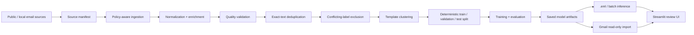

# SpamGuard

[](https://github.com/NRG-Wardog/SpamGuard/actions/workflows/ci.yml)
[](LICENSE)

**NLP email classification with governed data ingestion, leakage-resistant evaluation, and usable inference tooling.**

SpamGuard is an end-to-end machine-learning engineering project for classifying email as legitimate mail, spam, or phishing-oriented content. It started as a model-training notebook and evolved into a broader system covering **dataset provenance, policy-aware ingestion, normalization, quality validation, deduplication, template clustering, reproducible splitting, model evaluation, `.eml` inference, Gmail integration, and a Streamlit review interface**.

The engineering goal is not simply to train a classifier. It is to make the path from raw data to evaluation and inference **auditable, reproducible, and resistant to common data-quality and leakage problems**.

---

## Recorded Evaluation Evidence

A completed Transformer run preserved in the committed notebook records the following final metrics:

| Split | Accuracy | Precision | Recall | F1 | ROC AUC |
| --- | ---: | ---: | ---: | ---: | ---: |
| Validation | 99.32% | 99.45% | 99.02% | 99.23% | 99.97% |
| Test | 99.33% | 99.51% | 98.98% | 99.24% | 99.97% |

The same run records evaluation throughput of roughly **192 samples/second** on its test pass.

These values are evidence from a specific recorded experiment, **not a claim of universal real-world accuracy**. The repository now uses stricter dataset-governance and leakage-control machinery than the original notebook workflow, so future comparisons should be tied to a reproducible governed split.

See [`docs/RESULTS.md`](docs/RESULTS.md) for metric provenance, runtime details, and interpretation.

---

## Architecture


```mermaid
flowchart LR
    A[Public / local email sources] --> B[Source manifest]
    B --> C[Policy-aware ingestion]
    C --> D[Normalization + enrichment]
    D --> E[Quality validation]
    E --> F[Exact-text deduplication]
    F --> G[Conflicting-label exclusion]
    G --> H[Template clustering]
    H --> I[Deterministic train / validation / test split]
    I --> J[Training + evaluation]
    J --> K[Saved model artifacts]
    K --> L[.eml / batch inference]
    K --> M[Gmail read-only import]
    L --> N[Streamlit review UI]
    M --> N
```

The data pipeline is intentionally separate from the notebook so dataset preparation and validation can be tested without downloading or training a model.

---

## Engineering Highlights

### Governed data ingestion

Each source can carry provenance and usage metadata such as source name, license status, and whether it is permitted for training and/or evaluation. The pipeline preserves that metadata as records move through processing.

### Data-quality validation

`spamguard_data/validate.py` produces structured quality reports covering source, language and label distribution, missing/invalid rows, exact duplicate groups, conflicting labels, repeated normalized templates, link/phone coverage, extreme message lengths, and source-level policy metadata.

### Leakage-resistant dataset construction

`spamguard_data/build_combined.py` performs:

1. exact-text grouping and deduplication;
2. exclusion of identical text carrying conflicting labels;
3. template-hash clustering of structurally repeated messages;
4. deterministic cluster-level splitting;
5. explicit verification that neither exact text nor normalized templates overlap across train, validation, and test sets.

The split builder fails instead of silently continuing when leakage is detected.

### Reproducible testing

The repository includes deterministic tests for ingestion, manifest round-tripping, deduplication, conflicting-label handling, template clustering, reproducible splitting, and leakage detection. GitHub Actions runs the fast engineering suite on Python 3.10, 3.11, and 3.12.

### Inference and integration

The trained model can be used through raw `.eml` parsing, folder/batch classification, Gmail OAuth import in **read-only** mode, and a Streamlit interface for reviewing local/imported messages and predictions.

---

## Repository Layout

```text
SpamGuard/
├── spamguard_data/          # governed ingestion, validation, dedup and split pipeline
├── spamguard_demo/          # reusable .eml, Gmail and inference helpers
├── tests/                   # deterministic pipeline tests
├── docs/                    # engineering notes, results and images
├── data/                    # local/generated data artifacts; raw corpora are not redistributed
├── streamlit_app.py         # review/demo application
├── SpamGuard_Transformer_Email_Spam_Classifier.ipynb
├── requirements-demo.txt
└── README.md
```

---

## Run the Fast Engineering Tests

```bash
python -m unittest tests.test_data_pipeline -v
```

Model-dependent tests are kept separate because they require trained artifacts and heavier ML dependencies.

---

## Build Governed Dataset Splits

After configuring and ingesting approved sources:

```bash
python -m spamguard_data.validate
python -m spamguard_data.build_combined --seed 20260619
```

Review source licensing and allowed-use flags before enabling a source for training.

---

## Model Training

The original training workflow remains available in:

```text
SpamGuard_Transformer_Email_Spam_Classifier.ipynb
```

It covers environment setup, tokenization, Transformer training, evaluation, artifact saving, and `.eml` inference. The model is intentionally treated as one layer of the system rather than the entire project.

---

## Demo and Gmail Integration

```bash
pip install -r requirements-demo.txt
streamlit run streamlit_app.py
```

Gmail integration uses OAuth with the read-only Gmail scope. Imported messages are stored as local `.eml` snapshots for classification; the application does not delete, move, label, or modify Gmail messages.

---

## Sample Evaluation Output

<div align="center">
  
</div>

<div align="center">
  
</div>

---

## Engineering Principles

- **Evidence over a single headline metric**: inspect class-level behavior and failure modes.
- **Data policy is executable**: source permissions travel with the data pipeline.
- **Reproducibility matters**: deterministic splits and explicit seeds are part of the evaluation contract.
- **Leakage is a test failure**: repeated templates are treated as an evaluation risk, not only exact duplicates.
- **Model code is not the whole system**: ingestion, validation, integration and inference receive first-class engineering treatment.

---

## Known Limitations

- Email classification is sensitive to dataset and temporal distribution shift.
- Template hashing is a pragmatic leakage-control mechanism, not a complete semantic near-duplicate detector.
- The public repository does not redistribute third-party raw corpora.
- Gmail support is a read-only inference/demo integration rather than an enterprise mail-gateway deployment.
- Production deployment would require additional privacy controls, monitoring, adversarial evaluation, lifecycle management, and retraining policy.

---

## Data and Privacy

Raw third-party corpora are not redistributed. Users are responsible for obtaining datasets under applicable licenses/terms and for handling real email data according to appropriate privacy and organizational policy.

Do not process real user mail without authorization.

---

## License

Code is released under the [MIT License](LICENSE).
