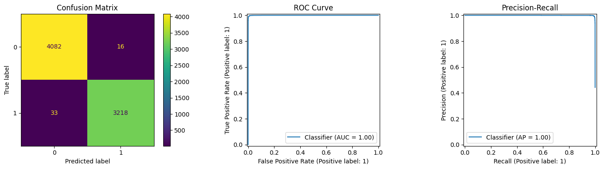
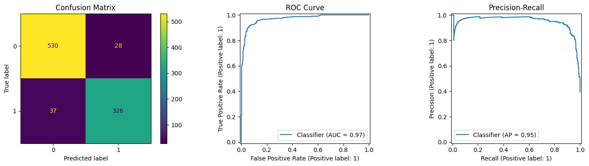

# SpamGuard

[](https://github.com/NRG-Wardog/SpamGuard/actions/workflows/ci.yml)
[](LICENSE)

**NLP email classification with governed data ingestion, leakage-resistant evaluation, and usable inference tooling.**

SpamGuard is an end-to-end machine-learning engineering project for classifying email as legitimate mail, spam, or phishing-oriented content. The project started as a model-training notebook and evolved into a broader system covering **dataset provenance, policy-aware ingestion, normalization, quality validation, deduplication, template clustering, reproducible splitting, model evaluation, `.eml` inference, Gmail integration, and a Streamlit review interface**.

The main engineering goal is not simply to train a classifier. It is to make the path from raw data to evaluation and inference **auditable, reproducible, and resistant to common data-quality and leakage problems**.

---

## Architecture


```mermaid
flowchart LR
    A[Public / local email sources] --> B[Source manifest]
    B --> C[Policy-aware ingestion]
    C --> D[Normalization + enrichment]
    D --> E[Quality validation]
    E --> F[Exact-text deduplication]
    F --> G[Conflicting-label exclusion]
    G --> H[Template clustering]
    H --> I[Deterministic train / validation / test split]
    I --> J[Training + evaluation]
    J --> K[Saved model artifacts]
    K --> L[.eml / batch inference]
    K --> M[Gmail read-only import]
    L --> N[Streamlit review UI]
    M --> N
```

The data pipeline is intentionally separate from the notebook so dataset preparation and validation can be tested without downloading or training a model.

---

## Engineering Highlights

### Governed data ingestion

Each source can carry provenance and usage metadata such as source name, license status, and whether it is permitted for training and/or evaluation. The pipeline preserves that metadata as records move through processing.

### Data-quality validation

`spamguard_data/validate.py` produces structured quality reports covering:

- source, language, and label distribution;
- missing or invalid rows;
- exact duplicate groups;
- conflicting labels for identical text;
- repeated normalized templates;
- link and phone-number coverage;
- extreme message-length cases;
- source-level policy metadata.

### Leakage-resistant dataset construction

`spamguard_data/build_combined.py` performs:

1. exact-text grouping and deduplication;
2. exclusion of identical text carrying conflicting labels;
3. template-hash clustering of structurally repeated messages;
4. deterministic cluster-level splitting;
5. explicit verification that neither exact text nor normalized templates overlap across train, validation, and test sets.

The split builder fails instead of silently continuing when leakage is detected.

### Reproducible testing

The repository includes deterministic tests for ingestion, manifest round-tripping, deduplication, conflicting-label handling, template clustering, reproducible splitting, and leakage detection.

### Inference and integration

The trained model can be used through:

- raw `.eml` parsing and classification;
- folder/batch classification;
- Gmail OAuth import in **read-only** mode;
- a Streamlit interface for reviewing imported/local messages and classification results.

---

## Repository Layout

```text
SpamGuard/
├── spamguard_data/          # governed ingestion, validation, dedup and split pipeline
├── spamguard_demo/          # reusable .eml, Gmail and inference helpers
├── tests/                   # deterministic pipeline/integration-oriented tests
├── test/                    # sample/local mail fixtures and runtime folders
├── docs/                    # project notes, dossier and result images
├── data/                    # local datasets and generated reports (raw corpora not redistributed)
├── streamlit_app.py         # review/demo application
├── SpamGuard_Transformer_Email_Spam_Classifier.ipynb
├── requirements-demo.txt
└── README.md
```

---

## Run the Fast Engineering Tests

The governance/data tests use only the Python standard library and repository code:

```bash
python -m unittest tests.test_data_pipeline -v
```

GitHub Actions runs these tests on supported Python versions for every pull request and push to `main`.

Model-dependent tests are kept separate because they require trained artifacts and heavier ML dependencies.

---

## Build Clean Dataset Splits

After configuring and ingesting approved sources:

```bash
python -m spamguard_data.validate
python -m spamguard_data.build_combined --seed 20260619
```

Generated reports and split files are written under the repository's data/report directories. Review source licensing and allowed-use flags before enabling a source for training.

---

## Model Training

The original training workflow remains available in:

```text
SpamGuard_Transformer_Email_Spam_Classifier.ipynb
```

It covers environment setup, tokenization, transformer training, evaluation, artifact saving, and `.eml` inference. The model implementation is intentionally treated as one layer of the system rather than the entire project.

Typical evaluation includes precision, recall, F1, confusion matrices, and optional ROC/PR analysis.

---

## Demo and Gmail Integration

Install demo dependencies:

```bash
pip install -r requirements-demo.txt
```

Run:

```bash
streamlit run streamlit_app.py
```

Gmail integration uses OAuth with the read-only Gmail scope. Imported messages are stored as local `.eml` snapshots for classification; the application does not delete, move, label, or modify Gmail messages.

The demo expects trained model artifacts to be available locally.

---

## Sample Evaluation Output

<div align="center">
  
</div>

<div align="center">
  
</div>

---

## Design Principles

- **Evidence over a single headline metric**: inspect class-level behavior and failure modes.
- **Data policy is executable**: source permissions travel with the data pipeline.
- **Reproducibility matters**: deterministic splits and explicit seeds are part of the evaluation contract.
- **Leakage is a test failure**: repeated templates are treated as a real evaluation risk, not just exact duplicate text.
- **Model code is not the whole system**: ingestion, validation, integration and inference receive first-class engineering treatment.

---

## Known Limitations

- Email classification is sensitive to dataset and temporal distribution shift.
- Template hashing is a pragmatic leakage-control mechanism, not a complete semantic near-duplicate detector.
- The public repository does not redistribute third-party raw corpora.
- Gmail support is intentionally a read-only demo/inference integration rather than an MTA or enterprise mail-gateway deployment.
- Production deployment would require additional privacy controls, monitoring, adversarial evaluation, lifecycle management, and retraining policy.

---

## Data and Privacy Policy

Raw third-party corpora are not redistributed by this repository. Users are responsible for obtaining datasets under their applicable licenses and terms and for handling real email data according to appropriate privacy and organizational policy.

Do not process real user mail without authorization.

---

## License

Code is released under the [MIT License](LICENSE).
